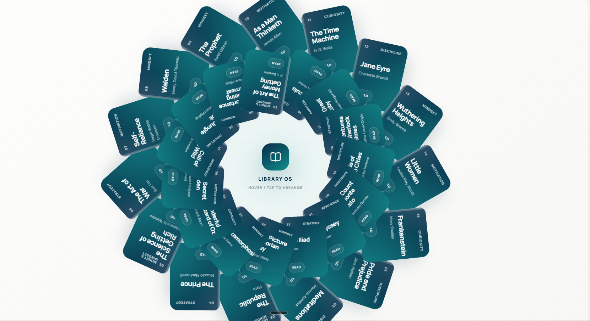

# Library OS



An interactive browser-based library experience backed by a C++17 REST service. Explore a rotating collection, choose a title, and read complete public-domain books in a paginated reader.

## Highlights

- Animated React + Vite interface with an orbiting book collection
- C++17 backend with a REST API for the catalog and book content
- Full-text public-domain book retrieval with a local cache
- Responsive two-page reader that switches to a single page on mobile
- JSON export for the currently loaded book and reader pages

## Tech stack

- Frontend: React, TypeScript, Vite, Framer Motion
- Backend: C++17, CMake, cpp-httplib, OpenSSL

## Run locally

Start the backend first:

```powershell
cd backend
cmake -S . -B build
cmake --build build --config Release
.\build\bin\LibraryOS.exe
```

In another terminal, start the frontend:

```powershell
cd frontend
npm install
npm run dev
```

The frontend development server proxies API requests to `http://localhost:8080`.

## Project structure

```text
frontend/   React user interface
backend/    C++17 API, domain model, and content cache
```

See [PROJECT_ARCHITECTURE.md](PROJECT_ARCHITECTURE.md) for the application design and [backend/README.md](backend/README.md) for API and backend details.
